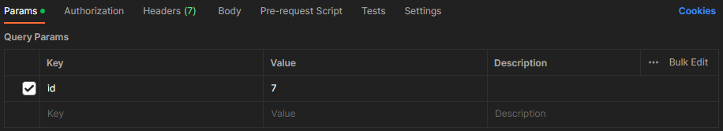
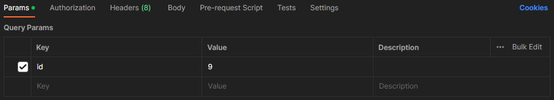
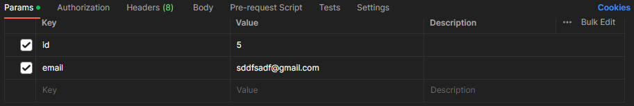

# Spring Boot and Hibernate CRUD App using MySQL Database
## API Endpoints for SpringBoot_Hibernate_CRUD with Sample INPUT:
<!-- #### [API End-Points GitHub Repository ->](https://github.com/Priyansusahoo/SpringBoot_Hibernate_crud_API_EndPoints) -->

## 1. getAllEmployees API :
- (GET) Request
- URL : http://localhost:9090/myapp/getAllEmployees

Response Body ->
(JSON)

    [
    {
        "id": 2,
        "firstName": "Priyansu",
        "lastName": "Sahoo",
        "email": "priyansusahoo1@gmail.com"
    },
    {
        "id": 3,
        "firstName": "Priyansu",
        "lastName": "Sahoo",
        "email": "priyansusahoo1@gmail.com"
    }
    ]

## 2. addEmployee API :
- (POST) Request
- URL : http://localhost:9090/myapp/addEmployee

Request Body :
(raw -> JSON)
    
    {
    "firstName" : "Priyansu",
    "lastName" : "Sahoo",
    "email" : "priyansusahoo1@gmail.com"
    }

Response Body ->
(JSON)

    true

## 3. getById :
- (GET) Request
- URL : http://localhost:9090/myapp/getById?id=7

Request Body :

Response Body ->
(JSON)

    {
    "id": 7,
    "firstName": "Priyansu",
    "lastName": "Sahoo",
    "email": "abc@gmail.com"
    }

## 4. deleteById :
- (PUT) Request
- URL : http://localhost:9090/myapp/deleteById?id=9

Request Body :

Response Body ->
(JSON)
    
    true

## 5. updateEmailById :
- (PUT) Request
- URL : http://localhost:9090/myapp/updateEmailById?id=5&email=sddfsadf@gmail.com

Request Body :

Response Body ->
(JSON)
    
    true

## 6. updateAddressById :
- (PUT) Request
- URL : http://localhost:9090/myapp/updateEmailById?id=5&email=sddfsadf@gmail.com

Request Body :

Response Body ->
(JSON)
    
    true
